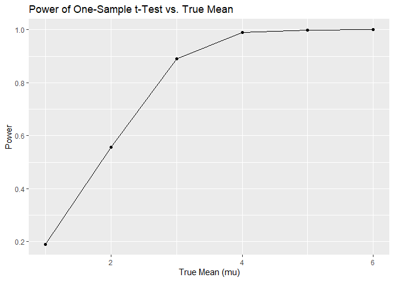
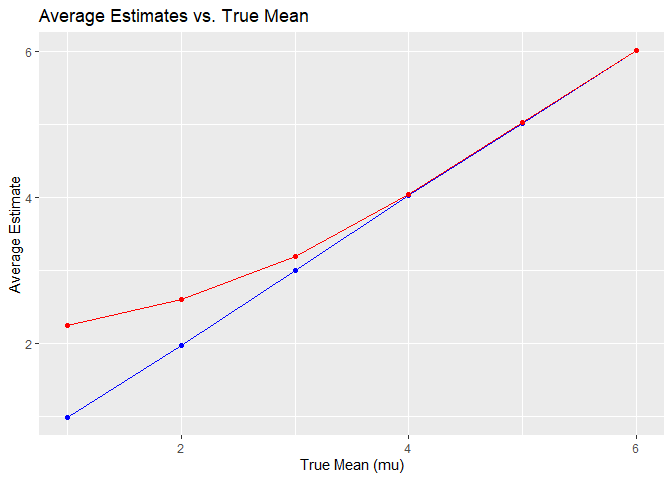
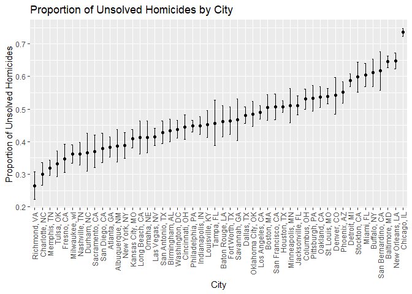

p8105_hw5_yy3564
================
Yonghao YU
2024-11-12

# Problem 2

### Set the parameters

``` r
n = 30
sigma = 5
alpha = 0.05
num_simulations = 5000
mu_values = 1:6
```

### Build the functions required to do the simulation for each μ

``` r
simulate_power = function(mu) {
  results = replicate(num_simulations, {

    data = rnorm(n, mean = mu, sd = sigma)
    
    t.test(data, mu = 0) |>
      broom::tidy() |>
      select(estimate, p.value)
  }, simplify = FALSE) |>
    bind_rows() 
  
  power = results |>
    filter(p.value < alpha) |>
    nrow() / nrow(results)
  
  avg_estimate = results |>
    pull(estimate) |>
    mean()
  
  avg_estimate_rejected = results |>
    filter(p.value < alpha) |>
    pull(estimate) |>
    mean()
  
  tibble(
    mu = mu,
    power = power,
    avg_estimate = avg_estimate,
    avg_estimate_rejected = avg_estimate_rejected
  )
}


simulation_results = map_dfr(mu_values, simulate_power)
```

### Make a plot showing the proportion of times the null was rejected on the y axis and the true value of μ on the x axis.

``` r
ggplot(simulation_results, aes(x = mu, y = power)) +
  geom_line() +
  geom_point() +
  labs(
    title = "Power of One-Sample t-Test vs. True Mean",
    x = "True Mean (mu)",
    y = "Power"
  )
```

<!-- -->

The association between effect size and power is positive and direct: as
the effect size increases, the power of the test also increases.

### Make a plot showing the average estimate of μ on the y axis and the true value of μ on the x axis (red color: only in samples for which the null is rejcted)

``` r
ggplot(simulation_results) +
  geom_line(aes(x = mu, y = avg_estimate), color = "blue") +
  geom_point(aes(x = mu, y = avg_estimate), color = "blue") +
  geom_line(aes(x = mu, y = avg_estimate_rejected), color = "red") +
  geom_point(aes(x = mu, y = avg_estimate_rejected), color = "red") +
  labs(
    title = "Average Estimates vs. True Mean",
    x = "True Mean (mu)",
    y = "Average Estimate"
  ) +
  scale_color_manual(
    values = c("blue" = "All Samples", "red" = "Rejected Samples")
  )
```

    ## Warning: No shared levels found between `names(values)` of the manual scale and the
    ## data's colour values.

<!-- -->

The sample average of the estimated mean across tests for which the null
hypothesis is rejected is generally not approximately equal to the true
value of the mean. It is because The sample average of the mean across
tests that reject the null hypothesis is biased and tends to
overestimate the true mean due to the inclusion of more extreme sample
values.

# Problem 3

### Load the homicide data

``` r
homicide_data = read_csv("data/homicide-data.csv")
```

    ## Rows: 52179 Columns: 12
    ## ── Column specification ────────────────────────────────────────────────────────
    ## Delimiter: ","
    ## chr (9): uid, victim_last, victim_first, victim_race, victim_age, victim_sex...
    ## dbl (3): reported_date, lat, lon
    ## 
    ## ℹ Use `spec()` to retrieve the full column specification for this data.
    ## ℹ Specify the column types or set `show_col_types = FALSE` to quiet this message.

``` r
homicide_data
```

    ## # A tibble: 52,179 × 12
    ##    uid        reported_date victim_last  victim_first victim_race victim_age
    ##    <chr>              <dbl> <chr>        <chr>        <chr>       <chr>     
    ##  1 Alb-000001      20100504 GARCIA       JUAN         Hispanic    78        
    ##  2 Alb-000002      20100216 MONTOYA      CAMERON      Hispanic    17        
    ##  3 Alb-000003      20100601 SATTERFIELD  VIVIANA      White       15        
    ##  4 Alb-000004      20100101 MENDIOLA     CARLOS       Hispanic    32        
    ##  5 Alb-000005      20100102 MULA         VIVIAN       White       72        
    ##  6 Alb-000006      20100126 BOOK         GERALDINE    White       91        
    ##  7 Alb-000007      20100127 MALDONADO    DAVID        Hispanic    52        
    ##  8 Alb-000008      20100127 MALDONADO    CONNIE       Hispanic    52        
    ##  9 Alb-000009      20100130 MARTIN-LEYVA GUSTAVO      White       56        
    ## 10 Alb-000010      20100210 HERRERA      ISRAEL       Hispanic    43        
    ## # ℹ 52,169 more rows
    ## # ℹ 6 more variables: victim_sex <chr>, city <chr>, state <chr>, lat <dbl>,
    ## #   lon <dbl>, disposition <chr>

### Describe the raw data

It is a homicide dataset covering 50 large U.S. cities. Each row
represents a homicide case with details on location (city, state),
victim demographics (age, race, sex), and case status (disposition),
such as “Open/No arrest” or “Closed by arrest.” The data includes
geographic coordinates (latitude, longitude) and the date the homicide
was reported. The primary focus is on calculating the proportion of
unsolved homicides (disposition marked as “Open/No arrest” or “Closed
without arrest”). This dataset highlights trends in homicide resolution
rates and demographic disparities across U.S. cities for transparency
and analysis.

### Data preprocessing

``` r
homicide_summary = homicide_data |>
  mutate(
    city_state = str_c(city, state, sep = ", "),
    unsolved = if_else(disposition %in% c("Closed without arrest", "Open/No arrest"), 1, 0)
  ) |>
  filter(city_state != "Tulsa, AL")|>
  group_by(city_state) |>
  summarize(
    total_homicides = n(),
    unsolved_homicides = sum(unsolved),
    .groups = "drop"
  ) 
```

### For the city of Baltimore, MD, estimate the proportion of homicides that are unsolved

``` r
baltimore_data = homicide_summary |>
  filter(city_state == "Baltimore, MD")

baltimore_test = prop.test(baltimore_data$unsolved_homicides, baltimore_data$total_homicides) |>
  broom::tidy()

baltimore_results = baltimore_test |>
  select(estimate, conf.low, conf.high)

baltimore_results
```

    ## # A tibble: 1 × 3
    ##   estimate conf.low conf.high
    ##      <dbl>    <dbl>     <dbl>
    ## 1    0.646    0.628     0.663

### Now run prop.test for each of the cities in my dataset

``` r
city_proportion_estimates = homicide_summary |>
  mutate(
    test_results = map2(unsolved_homicides, total_homicides, ~ prop.test(.x, .y) |> tidy())
  ) |>
  unnest(test_results) |>
  select(city_state, estimate, conf.low, conf.high) |>
  arrange(desc(estimate))
city_proportion_estimates
```

    ## # A tibble: 50 × 4
    ##    city_state         estimate conf.low conf.high
    ##    <chr>                 <dbl>    <dbl>     <dbl>
    ##  1 Chicago, IL           0.736    0.724     0.747
    ##  2 New Orleans, LA       0.649    0.623     0.673
    ##  3 Baltimore, MD         0.646    0.628     0.663
    ##  4 San Bernardino, CA    0.618    0.558     0.675
    ##  5 Buffalo, NY           0.612    0.569     0.654
    ##  6 Miami, FL             0.605    0.569     0.640
    ##  7 Stockton, CA          0.599    0.552     0.645
    ##  8 Detroit, MI           0.588    0.569     0.608
    ##  9 Phoenix, AZ           0.551    0.518     0.584
    ## 10 Denver, CO            0.542    0.485     0.598
    ## # ℹ 40 more rows

### Create a plot that shows the estimates and CIs for each city

``` r
city_proportion_estimates|>
  ggplot(aes(x = reorder(city_state, estimate), y = estimate)) +
  geom_point() +
  geom_errorbar(aes(ymin = conf.low, ymax = conf.high), width = 0.2) +
  labs(
    title = "Proportion of Unsolved Homicides by City",
    x = "City",
    y = "Proportion of Unsolved Homicides"
  ) +
  theme(
    axis.text.x = element_text(angle = 90, hjust = 1, vjust = 0.5)
  )
```

<!-- -->
